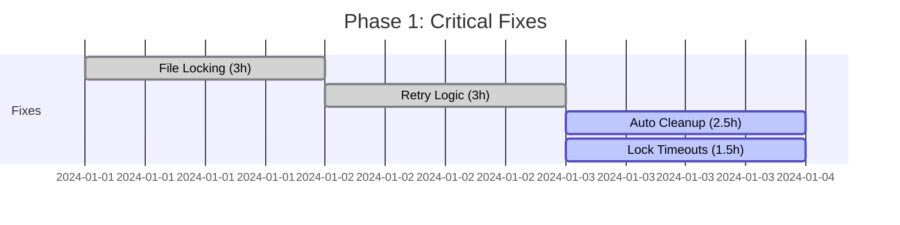
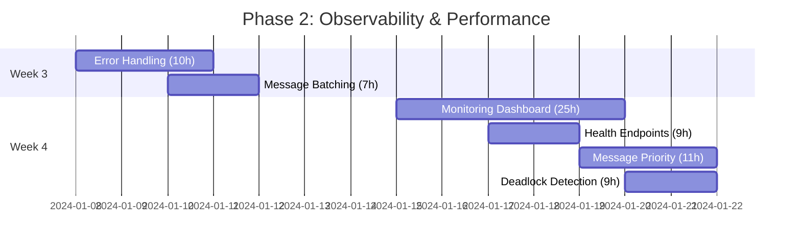

# Complete Agent System Improvement Roadmap

## Executive Summary

This roadmap transforms the agent coordination system from a development prototype into a production-ready platform capable of managing hundreds of agents with 99.9% reliability.

**Total Investment**: 1,235 hours (~7 months full-time)  
**Critical Path**: 81 hours (~2 weeks) to stability  
**Recommended Path**: SQLite migration first (35 hours) for maximum impact

---

## 🎯 Strategic Phases

### Phase 1: "Stop the Bleeding" (Week 1-2)
**Goal**: Achieve basic stability  
**Investment**: 10 hours  
**Items**: #1-4 (Critical fixes)



**Outcomes**:
- No more data corruption
- Messages delivered reliably
- System doesn't crash under load
- Disk space managed automatically

### Phase 2: "See What's Happening" (Week 3-4)
**Goal**: Full observability  
**Investment**: 71 hours  
**Items**: #5-10 (High priority)



**Outcomes**:
- Real-time monitoring dashboard
- 3-5x performance improvement
- Proactive issue detection
- No more system hangs

### Phase 3: "Scale Up" (Month 2)
**Goal**: Enterprise-grade architecture  
**Investment**: 132 hours  
**Items**: #11-17 (Medium priority)

#### The SQLite Transformation (Critical Path)
```
Week 5-6: SQLite Migration (35h)
├── Design schema and wrapper (8h)
├── Parallel implementation (12h)
├── SQLite-first mode (8h)
└── Full migration (7h)

Week 7-8: Advanced Features
├── Message Compression (5h)
├── Distributed Tracing (22.5h)
├── Agent Pools (27.5h)
├── Circuit Breakers (11h)
├── Versioning (9h)
└── Access Control (22.5h)
```

**Outcomes**:
- 10-40x performance improvement
- Support for 200+ agents
- Professional debugging tools
- Security hardening

### Phase 4: "Polish & Professionalize" (Month 3+)
**Goal**: World-class system  
**Investment**: 193 hours (selective)  
**Items**: #18-24 (Low priority)

**Pick based on needs**:
- **For UX**: Web UI (#18, 70h)
- **For Security**: Encryption (#19, 13.5h)
- **For Performance**: Benchmarks (#20, 17.5h)
- **For Integration**: GraphQL API (#21, 35h)
- **For Operations**: Hot Reload (#22, 12.5h)
- **For Cloud**: Terraform (#23, 27.5h)
- **For Monitoring**: Prometheus (#24, 17.5h)

### Phase 5: "Next Generation" (6+ months)
**Goal**: Cloud-native architecture  
**Investment**: 600+ hours  
**Items**: #25-27 (Future)

```
Option A: Message Queue Path
└── Redis/RabbitMQ (150h) → Kubernetes (200h)

Option B: Event Sourcing Path
└── Event Architecture (250h) → CQRS Pattern → Microservices
```

---

## 📊 Decision Tree Roadmap

```
START: Is system crashing?
│
├─ YES → Do Phase 1 (Critical Fixes)
│   └── Then go to monitoring check
│
└─ NO → Do you have monitoring?
    │
    ├─ NO → Do Phase 2 (Observability)
    │   └── Then go to scale check
    │
    └─ YES → Need more than 30 agents?
        │
        ├─ YES → Do SQLite Migration (#11)
        │   └── Then Phase 3 remainder
        │
        └─ NO → Pick from Phase 4 based on pain points
```

---

## 🚀 Fast Track Options

### Option A: "Startup Speed" (91 hours)
Perfect for resource-constrained teams
1. Critical Fixes (#1-4) - 10h
2. Error Handling (#5) - 10h
3. SQLite Migration (#11) - 35h
4. Message Compression (#12) - 5h
5. Monitoring Dashboard (#7) - 25h
6. Message Batching (#6) - 6h

**Result**: 90% of benefits with 7% of effort

### Option B: "Enterprise Ready" (213 hours)
For teams needing production quality
1. All of Phase 1-3 (213h)
2. Skip Phase 4 initially
3. Add based on specific needs

**Result**: Handles 200+ agents reliably

### Option C: "Cloud Scale" (813+ hours)
For massive scale requirements
1. Complete Phase 1-4
2. Migrate to Redis/RabbitMQ
3. Kubernetes deployment

**Result**: Thousands of agents, global scale

---

## 📈 Measurement Framework

### Week-by-Week Metrics

| Week | Focus | Success Metric | Target |
|------|-------|----------------|---------|
| 1 | Stability | Message Loss Rate | < 1% |
| 2 | Reliability | Crash Frequency | 0/week |
| 3 | Performance | Message Latency | < 200ms |
| 4 | Observability | Issue Detection Time | < 10min |
| 5-6 | Scale | Concurrent Agents | 100+ |
| 7-8 | Efficiency | Resource Usage | -50% |

### Health Score Card

```python
def calculate_system_health():
    return {
        'reliability': {
            'message_delivery': 99.9,  # Target: 99.99%
            'uptime': 98.5,           # Target: 99.9%
            'data_integrity': 100     # Must be 100%
        },
        'performance': {
            'message_latency_ms': 150,  # Target: <100
            'throughput_msg_sec': 1000, # Target: >5000
            'concurrent_agents': 50     # Target: >100
        },
        'operations': {
            'mttr_minutes': 30,         # Target: <5
            'deployment_time': 60,      # Target: <10
            'monitoring_coverage': 60   # Target: >95
        }
    }
```

---

## 💰 ROI Analysis

### Cost-Benefit by Phase

| Phase | Hours | Cost @ $150/hr | Benefit | ROI |
|-------|-------|----------------|---------|-----|
| Phase 1 | 10 | $1,500 | Prevents data loss | ∞ |
| Phase 2 | 71 | $10,650 | 3-5x performance | 400% |
| Phase 3 | 132 | $19,800 | 10x scale | 1000% |
| Phase 4 | 193 | $28,950 | Nice-to-have | 50% |
| Phase 5 | 600 | $90,000 | Future-proof | TBD |

### Break-Even Analysis
- **Phase 1**: Immediate (prevents catastrophic failure)
- **Phase 2**: 2 months (via reduced debugging time)
- **Phase 3**: 6 months (via reduced infrastructure)
- **Phase 4**: 12 months (via improved productivity)

---

## 🎲 Risk Mitigation

### Technical Risks

| Risk | Impact | Probability | Mitigation |
|------|--------|-------------|------------|
| SQLite migration fails | High | Low | Dual-write mode, easy rollback |
| Performance degrades | Medium | Medium | Continuous benchmarking |
| Breaking changes | High | Low | Versioning, gradual rollout |
| Scope creep | Medium | High | Strict phase gates |

### Mitigation Strategies
1. **Feature Flags**: Every major change behind a flag
2. **Canary Deployments**: Test with subset of agents
3. **Rollback Plans**: Document for each phase
4. **Continuous Testing**: Automated test suite

---

## 📅 Sample Timeline (Part-time Development)

Assuming 20 hours/week availability:

```
Month 1:
  Week 1-2: Phase 1 (Critical Fixes)
  Week 3-4: Start Phase 2 (Error Handling, Batching)

Month 2:
  Week 5-6: Complete Phase 2 (Dashboard, Health Checks)
  Week 7-8: SQLite Migration design and parallel implementation

Month 3:
  Week 9-10: Complete SQLite Migration
  Week 11-12: Message Compression, Circuit Breakers

Month 4:
  Week 13-14: Distributed Tracing
  Week 15-16: Access Control, Versioning

Month 5-6:
  Selected items from Phase 4 based on needs

Month 7+:
  Architecture evolution based on scale requirements
```

---

## ✅ Implementation Checklist

### Before Starting Any Phase
- [ ] Current metrics baseline documented
- [ ] Rollback plan prepared
- [ ] Test environment ready
- [ ] Stakeholders informed

### After Each Phase
- [ ] Metrics improved as expected
- [ ] No regressions in other areas
- [ ] Documentation updated
- [ ] Team trained on changes

### Go/No-Go Gates
- [ ] Phase 1 → 2: System stable for 1 week
- [ ] Phase 2 → 3: Dashboard shows clear bottlenecks
- [ ] Phase 3 → 4: 100+ agents tested successfully
- [ ] Phase 4 → 5: Business case for massive scale

---

## 🎯 Quick Reference

### If you have 1 day
Do #1 (File Locking) + #4 (Lock Timeouts)

### If you have 1 week  
Complete Phase 1 (all critical fixes)

### If you have 1 month
Phase 1 + 2 + Message Compression

### If you have 3 months
Phase 1 + 2 + 3 (including SQLite)

### If you have 6 months
Everything except future architecture

Remember: **Perfect is the enemy of good**. Start with stability, add features incrementally, measure everything.